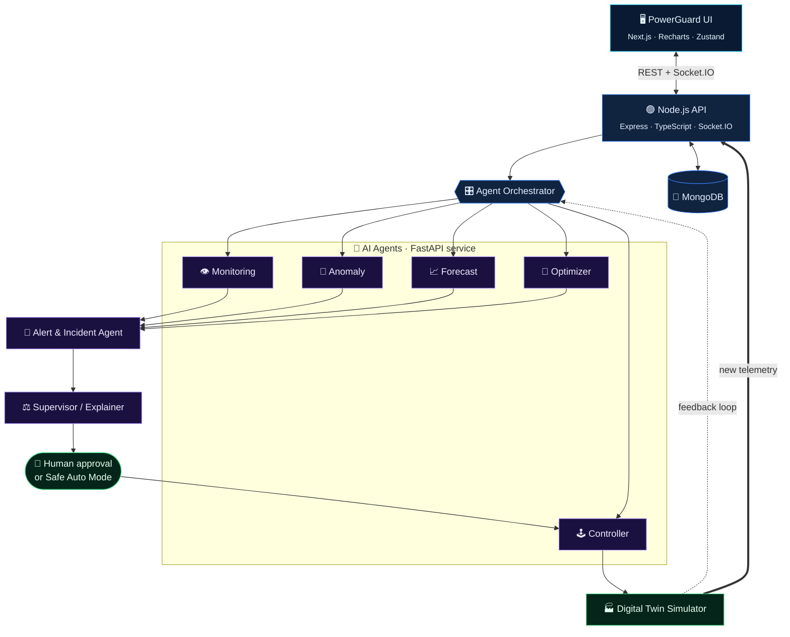
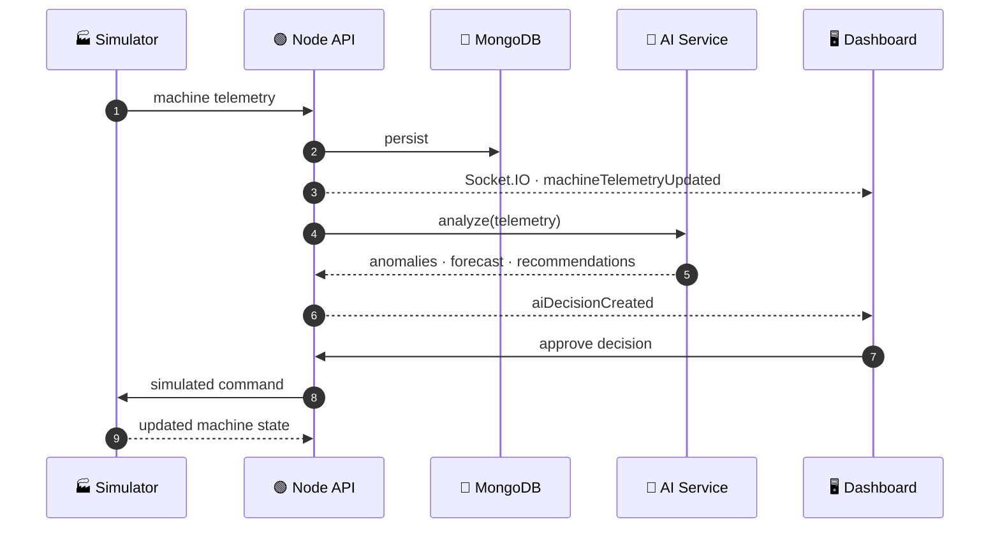
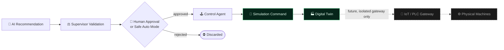

<div align="center">


<br/>

# ⚡ PowerGuard

### AI-Based Factory Energy Management

**Multi-agent AI · Real-time machine simulation · Anomaly detection · Forecasting · Optimization · Explainable decisions · Digital-twin control**

<br/>


[Overview](#-overview) ·
[Architecture](#-multi-agent-architecture) ·
[Agents](#-the-seven-agents) ·
[Simulator](#-digital-factory-simulator) ·
[Modules](#-application-modules) ·
[Quick Start](#-quick-start) ·
[API](#-api-reference) ·
[Roadmap](#-roadmap)

</div>

---

> [!IMPORTANT]
> **Academic project.** PowerGuard is a final-year engineering project. All machine-control actions run against a safe **Digital Twin / Simulator** layer. The system **never** sends commands to real industrial equipment.

## 📌 Overview

Factories run many machines with different power profiles, production priorities and schedules. Conventional energy monitors **show** consumption but rarely **act** on it.

PowerGuard closes that gap. It streams simulated factory telemetry through a team of specialised AI agents that watch, detect, forecast, optimise, explain and (with approval) act, all in a single full-stack platform.

<table>
<tr>
<td width="33%" valign="top">

### 👁️ Observe
- Live machine telemetry
- Idle & high-load detection
- Anomaly scoring
- Peak-demand tracking

</td>
<td width="33%" valign="top">

### 🧠 Decide
- 1 h / 6 h / 24 h forecasts
- Constraint-aware optimisation
- Supervisor conflict resolution
- Human-readable explanations

</td>
<td width="33%" valign="top">

### ⚙️ Act
- Simulated machine commands
- Human approval or safe auto-mode
- Alerts & incident lifecycle
- Savings, cost & CO₂ tracking

</td>
</tr>
</table>

### 🎯 Objectives

| # | Objective |
|:-:|---|
| 1 | Build a real-time factory energy monitoring platform |
| 2 | Design a multi-agent AI architecture for energy management |
| 3 | Detect abnormal consumption with ML / statistical methods |
| 4 | Forecast future factory energy demand |
| 5 | Optimise machine operation while respecting production priority |
| 6 | Provide explainable AI recommendations |
| 7 | Simulate machine control through a Digital Twin |
| 8 | Track energy savings and estimated cost reduction |
| 9 | Deliver real-time dashboards and analytics |
| 10 | Stay extensible to future IoT / PLC gateway integration |

---

## 🧠 Multi-Agent Architecture

PowerGuard uses **specialised cooperating agents** instead of one monolithic AI component.



### 🔄 Real-time data flow



---

## 🤖 The Seven Agents

<table>
<tr><th width="4%"></th><th width="20%">Agent</th><th>Responsibility</th></tr>
<tr><td>👁️</td><td><b>Energy Monitoring</b></td><td>Analyses voltage, current, power factor, power, energy, load %, temperature, status and operating hours. Flags high-consumption machines and idle draw.</td></tr>
<tr><td>🚨</td><td><b>Anomaly Detection</b></td><td>Isolation Forest, Z-score, rolling mean / std-dev and historical-baseline comparison → severity + score + reason.</td></tr>
<tr><td>📈</td><td><b>Energy Forecasting</b></td><td>Predicts <code>+1 h</code>, <code>+6 h</code>, <code>+24 h</code> demand from history, utilisation, time-of-day, day-of-week, schedule and machine state.</td></tr>
<tr><td>🧮</td><td><b>Energy Optimization</b></td><td>Produces energy-saving actions with expected saving, confidence, production impact and priority.</td></tr>
<tr><td>🕹️</td><td><b>Machine Control</b></td><td>Turns <i>approved</i> recommendations into safe simulated commands.</td></tr>
<tr><td>🔔</td><td><b>Alert & Incident</b></td><td>Manages excess consumption, anomalies, over-temperature, peak risk, faults and comms failures.</td></tr>
<tr><td>⚖️</td><td><b>Supervisor / Explainer</b></td><td>Validates outputs, detects conflicts, weighs production priority, computes overall confidence and writes the explanation.</td></tr>
</table>

<details>
<summary><b>📋 Action &amp; command vocabulary</b></summary>

| Optimizer actions | Control commands | Alert levels |
|---|---|---|
| `REDUCE_LOAD` | `START_MACHINE` | `INFO` |
| `STOP_IDLE_MACHINE` | `STOP_MACHINE` | `WARNING` |
| `ENTER_STANDBY` | `REDUCE_LOAD` | `HIGH` |
| `SHIFT_OPERATION` | `INCREASE_LOAD` | `CRITICAL` |
| `OPTIMIZE_SCHEDULE` | `ENTER_STANDBY` | |
| `KEEP_RUNNING` | `EXIT_STANDBY` | |

</details>

<details>
<summary><b>🔍 Example — anomaly output</b></summary>

```json
{
  "machineId": "M-003",
  "anomaly": true,
  "severity": "HIGH",
  "score": 0.91,
  "reason": "Energy consumption is significantly above the historical operating baseline"
}
```

</details>

<details>
<summary><b>💬 Example — explainable decision</b></summary>

```text
PROBLEM         M-004 has remained idle for an extended period.
EVIDENCE        Current power 11.2 kW · Historical idle power 10.8 kW · Priority LOW
RECOMMENDATION  Enter standby mode
EXPECTED SAVING ≈ 3.7 kWh/hour
CONFIDENCE      91 %
```

</details>

---

## 🏭 Digital Factory Simulator

The full system can be demonstrated **without physical hardware**. The simulator generates evolving telemetry and reacts to simulated AI commands.

| ID | Machine | Department |
|:-:|---|---|
| `M-001` | 🔧 CNC Machine | Production |
| `M-002` | 💨 Industrial Compressor | Utilities |
| `M-003` | 🧪 Injection Molding Machine | Production |
| `M-004` | 📦 Conveyor System | Assembly |
| `M-005` | 🚰 Industrial Pump | Utilities |
| `M-006` | ❄️ HVAC Unit | Utilities |
| `M-007` | 🔥 Welding Machine | Production |
| `M-008` | 🎁 Packaging Machine | Packaging |

**States:** `RUNNING` · `IDLE` · `STANDBY` · `MAINTENANCE` · `OFFLINE` · `FAULT`

### 🎮 Demo scenarios

| Scenario | What it triggers |
|---|---|
| ✅ Normal Operation | Baseline machine behaviour |
| 🔥 High Energy Consumption | Raises machine load and factory power |
| 🚨 Machine Anomaly | Abnormal energy pattern |
| 📈 Peak Demand | Predicted demand spike |
| 💤 Idle Machine | Low-priority machine running needlessly |
| 🛠️ Machine Fault | Abnormal / faulty behaviour |
| 🌱 Energy Optimization | Runs the complete AI decision workflow |

---

## 🖥️ Application Modules

| Module | Highlights |
|---|---|
| 📊 **Dashboard** | Total power & energy, active machines, efficiency, energy saved, alerts, AI actions, peak demand · live power, department, forecast & savings charts |
| 🏭 **Factory Digital Twin** | Live visual factory: states, power, load, temperature, department grouping, simulation controls |
| ⚙️ **Machine Monitoring** | Telemetry, power / temperature / load graphs, efficiency, anomaly history, AI recommendations, simulated control |
| 🤖 **AI Agent Center** | Agent status, current activity, tasks processed, confidence, activity timeline |
| 🧾 **AI Decision Center** | Recommendation tracking: `PENDING` → `APPROVED` / `REJECTED` → `EXECUTED` / `SIMULATED` |
| 🔔 **Alert Center** | Severity & machine filters, search, acknowledge, resolve, history |
| 📉 **Energy Analytics** | Daily / weekly / monthly use, peak demand, average load, cost, efficiency |
| 🔮 **Forecasting** | 1 h / 6 h / 24 h predictions, actual-vs-predicted, peak prediction, confidence |
| 🌱 **Energy Savings** | Baseline vs. optimised energy, cost saved, CO₂ reduced |
| 💬 **AI Assistant** | Natural-language factory Q&A grounded in application data (never invents values) |

<details>
<summary><b>🧮 Savings formulas</b></summary>

```text
Energy Saved          = Baseline Energy − Optimized Energy
Estimated Cost Saved  = Energy Saved × Electricity Tariff
Estimated CO₂ Cut     = Energy Saved × Emission Factor
```

Simulation-based values are always labelled as **estimates**.

</details>

<details>
<summary><b>💬 Sample AI Assistant questions</b></summary>

- Which machine consumes the most power?
- Why is `M-003` consuming more energy?
- Which machines are currently inefficient?
- How much energy did AI save today?
- What is the predicted peak demand?
- Why did the system recommend standby for `M-004`?
- What happened during the latest anomaly?

</details>

---

## 🛠️ Technology Stack

| Layer | Technologies |
|---|---|
| **Frontend** | Next.js 15+, React, TypeScript, Tailwind CSS, shadcn/ui, Framer Motion, Recharts, TanStack Query, Zustand, Socket.IO Client, Lucide |
| **Backend** | Node.js, Express, TypeScript, Socket.IO, Mongoose, JWT, bcrypt, Zod, Helmet, rate limiting |
| **AI / ML** | Python, FastAPI, scikit-learn, Pandas, NumPy, optional XGBoost, Gemini / OpenAI API |
| **Database** | MongoDB Atlas · local MongoDB |
| **DevOps** | Docker, Docker Compose, GitHub Actions |

### 🔐 Roles

| Role | Access |
|---|---|
| 👑 **Admin** | Full system access |
| 📊 **Energy Manager** | Analytics, AI decisions, approvals |
| 🧑‍🏭 **Operator** | Machines, alerts, simulation |
| 👁️ **Viewer** | Read-only |

Authentication uses **JWT** with **role-based access control**.

<details>
<summary><b>📁 Project structure</b></summary>

```text
powerguard/
├── apps/
│   ├── web/                  # Next.js frontend
│   │   ├── app/  components/  hooks/  lib/  services/
│   ├── api/                  # Express + TypeScript backend
│   │   ├── src/  controllers/ routes/ models/ services/ middleware/ sockets/ utils/
│   │   └── tests/
│   └── ai-service/           # FastAPI + ML agents
│       ├── app/  agents/ models/ forecasting/ anomaly/ optimization/ orchestrator/
│       └── tests/
├── simulator/                # machines · scenarios · simulation-engine
├── packages/                 # shared-types · config
├── docs/                     # architecture · api · project-report
├── docker/
├── docker-compose.yml
├── .env.example
└── README.md
```

</details>

---

## 🚀 Quick Start

### Prerequisites

`Node.js 20+` · `Python 3.11+` · `MongoDB / Atlas` · `Git` · `Docker Desktop` *(optional)*

### 1 · Clone

```bash
git clone https://github.com/YOUR_USERNAME/powerguard.git
cd powerguard
```

### 2 · Configure

```bash
cp .env.example .env
```

```env
MONGODB_URI=mongodb://localhost:27017/powerguard
JWT_SECRET=your_secure_jwt_secret

GEMINI_API_KEY=your_gemini_api_key
OPENAI_API_KEY=your_openai_api_key

NEXT_PUBLIC_API_URL=http://localhost:5000
NEXT_PUBLIC_WS_URL=http://localhost:5000
AI_SERVICE_URL=http://localhost:8000

ENERGY_TARIFF=8
EMISSION_FACTOR=0.82
```

> [!WARNING]
> Never commit `.env` files or API keys to GitHub.

### 3 · Run

<table>
<tr>
<th width="50%">🐳 Docker <i>(recommended)</i></th>
<th width="50%">💻 Manual</th>
</tr>
<tr>
<td valign="top">

```bash
docker compose up --build
# detached
docker compose up -d
# logs / stop
docker compose logs -f
docker compose down
```

</td>
<td valign="top">

```bash
# backend
cd apps/api && npm install && npm run dev

# AI service
cd apps/ai-service
python -m venv .venv
source .venv/bin/activate   # Windows: .venv\Scripts\activate
pip install -r requirements.txt
uvicorn app.main:app --reload --port 8000

# frontend
cd apps/web && npm install && npm run dev
```

</td>
</tr>
</table>

Open **http://localhost:3000** 🎉

### 🧪 Testing

```bash
npm test            # backend tests
npm run lint        # linting
npm run typecheck   # TypeScript checks
npm run build       # production build
pytest              # AI service tests
```

---

## 🔌 API Reference

<details open>
<summary><b>REST endpoints</b></summary>

| Group | Endpoints |
|---|---|
| **Auth** | `POST /api/auth/register` · `POST /api/auth/login` · `GET /api/auth/me` |
| **Machines** | `GET /api/machines` · `GET /api/machines/:id` · `POST /api/machines` · `PUT /api/machines/:id` |
| **Telemetry** | `GET /api/telemetry` · `GET /api/telemetry/:machineId` · `POST /api/telemetry` |
| **AI** | `POST /api/ai/analyze` · `POST /api/ai/optimize` · `POST /api/ai/forecast` |
| **Decisions** | `GET /api/decisions` · `GET /api/decisions/:id` · `POST /api/decisions/:id/approve` · `POST /api/decisions/:id/reject` |
| **Commands** | `GET /api/commands` · `POST /api/commands/simulate` |
| **Alerts** | `GET /api/alerts` · `POST /api/alerts/:id/acknowledge` · `POST /api/alerts/:id/resolve` |
| **Analytics** | `GET /api/analytics/energy` · `GET /api/analytics/savings` · `GET /api/analytics/peak-demand` |

</details>

<details>
<summary><b>⚡ Socket.IO events</b></summary>

`machineTelemetryUpdated` · `machineStatusChanged` · `alertCreated` · `aiDecisionCreated` · `aiDecisionUpdated` · `machineCommandExecuted` · `energySavingRecorded` · `simulationStarted` · `simulationStopped`

</details>

---

## 🔒 Safety & Simulation Architecture



The dashed path is **not implemented**. Any real-world deployment would require an isolated gateway plus additional industrial safety mechanisms and authorisation.

---

## 📊 Key Performance Indicators

| ⚡ Total Power | 🔋 Total Energy | 📈 Peak Demand | ⚙️ Machine Efficiency |
|:-:|:-:|:-:|:-:|
| **💰 Cost Saved** | **🌍 CO₂ Reduction** | **🤖 AI Decisions** | **🚨 Active Alerts** |
| **🔎 Anomaly Count** | **🎯 Forecast Accuracy** | **🏭 Utilisation** | **🌱 Energy Saved** |

## 🌱 Sustainability

PowerGuard helps surface unnecessary machine operation, peak-demand conditions, inefficient behaviour and standby opportunities, supporting:

| SDG | Goal |
|:-:|---|
| **7** | Affordable & Clean Energy |
| **9** | Industry, Innovation & Infrastructure |
| **12** | Responsible Consumption & Production |
| **13** | Climate Action |

---

## 🗺️ Roadmap

- [x] Multi-agent architecture & orchestrator
- [x] Digital-twin machine simulator with scenarios
- [x] Real-time dashboard, alerts & decision workflow
- [ ] Industrial IoT sensors · MQTT · OPC-UA · PLC gateway
- [ ] Real-time power-meter integration & edge AI
- [ ] Reinforcement-learning optimisation
- [ ] Carbon-aware scheduling · renewables · solar forecasting · battery storage
- [ ] Predictive maintenance
- [ ] Multi-factory enterprise management & cloud deployment
- [ ] Time-series database (TimescaleDB / InfluxDB)
- [ ] 3D WebGL digital-twin visualisation

---

## 🎓 Academic Contribution

```text
   Artificial Intelligence ─┐
   Machine Learning ────────┤
   Multi-Agent Systems ─────┤
   Industrial Energy Mgmt ──┼──►  PowerGuard
   Real-Time Systems ───────┤
   Digital-Twin Simulation ─┤
   Full-Stack Development ──┤
   Explainable AI ──────────┘
```

A software-based framework for intelligent factory energy management that needs **no physical industrial hardware** to demonstrate.

| | |
|---|---|
| **Project** | PowerGuard |
| **Title** | AI-Based Factory Energy Management |
| **Type** | Final Year Engineering Project |
| **Domain** | AI · Industrial Energy Management · Full-Stack Development |

## 📜 License

Intended primarily for academic and educational use. Add an appropriate open-source license (e.g. MIT) before any public production use.

<div align="center">

<sub>Built with ⚡ for smarter, greener factories.</sub>

</div>
